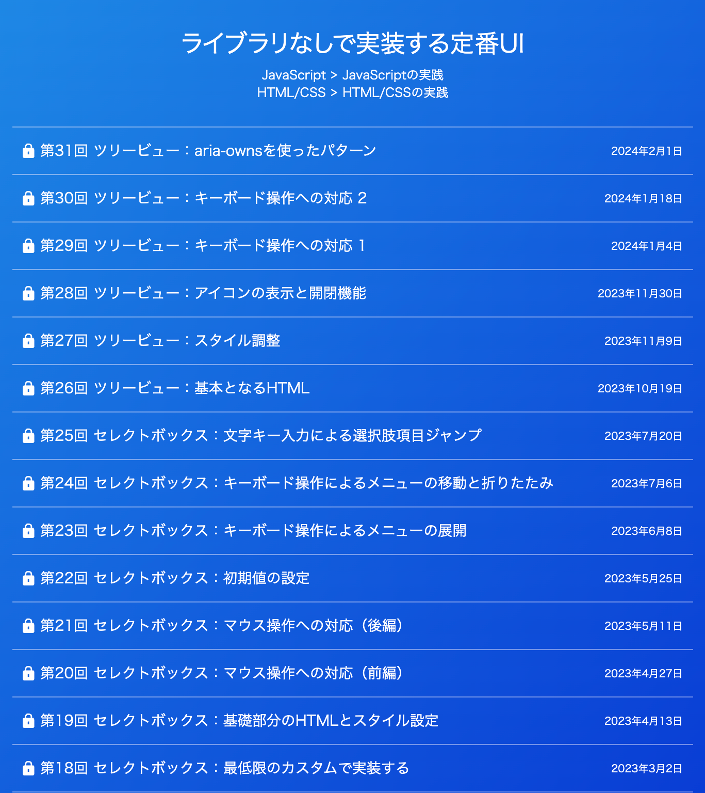
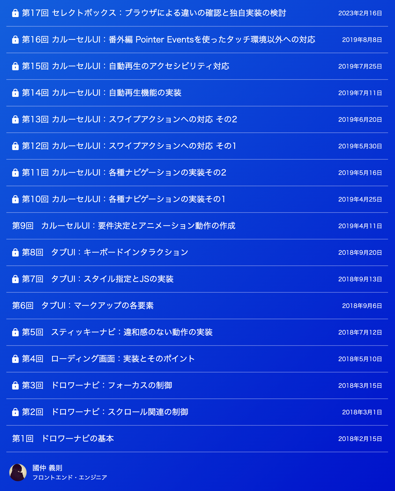
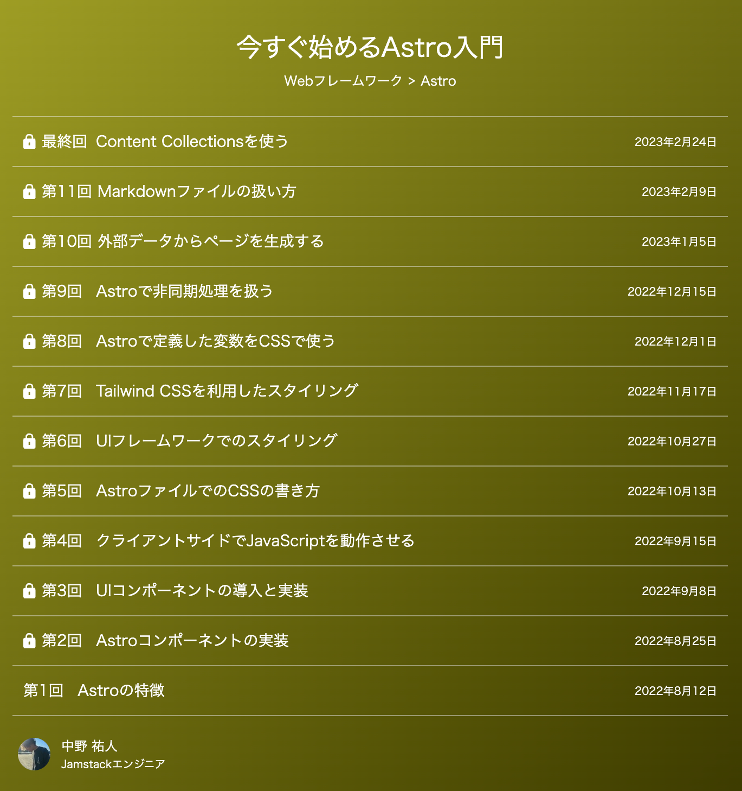
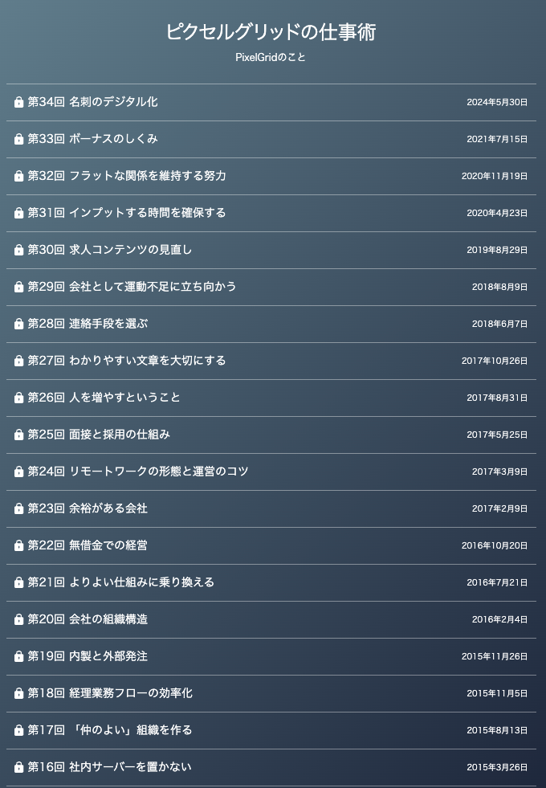
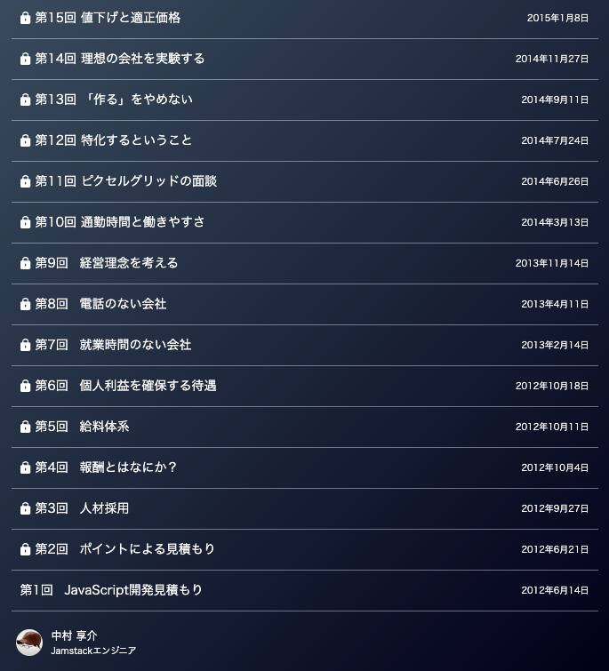

---
# You can also start simply with 'default'
theme: ./theme
# some information about your slides (markdown enabled)
title: CodeGrid記事かいつまみ紹介

class: text-center
# https://sli.dev/features/drawing
drawings:
  persist: false
# slide transition: https://sli.dev/guide/animations.html#slide-transitions
transition: slide-left
# enable MDC Syntax: https://sli.dev/features/mdc
mdc: true
---

# CodeGrid記事
# かいつまみ紹介

<p class="text-right pt-15">株式会社ピクセルグリッド　中野祐人</p>
<p class="text-right">2024.08.24 フロントエンドカンファレンス北海道</p>

---
layout: two-cols-with-title
---

# 自己紹介

::left::
<SlidevVideo class="rounded-5 video"  autoplay loop muted>
  <source   src="./assets/snowboard.mp4" />
</SlidevVideo>
🗻ルスツリゾート

::right::

<SelfIntroduction />
---

# 目次

<TableOfContents />

<!--
- はじめにCodeGridとは？どんな記事が読めるのか?という部分を紹介しながら、
- おすすめしたいきじをごしょうかいさせていただきます
-->

---
title: CodeGridとは?
---

<Heading>CodeGridとは？</Heading>

<!--
- 本番では知っている人、購読してくれている人、みたいなのを聞く
-->

---
layout: image-left
image: ./assets/codegrid.png
backgroundSize: contain
hideInToc: true
---

## CodeGrid基本情報
CodeGridはフロントエンドに携わる人に向けて書かれたWebマガジンです。

<div class="text-4"> 

- 記事はすべて社員が書いてます！(たまに寄稿してもらうことも)
- 創刊してから12年！
- 月に4回、1回3記事の、月間合計12記事が発行。
- 月額880円（税込）ですべての記事が読み放題！
- 12年で記事総数は1781本以上！
- 最初の30日間は無料！

</div>

<!-- 実際はどんな記事が読めるのか、ワードクラウドを作りました。 -->
---
layout: section
---

## どんな内容の記事が読めるの？

---
layout: image
image: ./assets/wordcloud-1.png
---

<!-- 
この画像は、CodeGridのカテゴリーごとの記事数から、記事数が多いもののフォントがが大きく、記事数が少ないものが小さくなるように作ったワードクラウドです。
なので、どのような記事が多いのかを視覚的に表現しています。
この画像を細かく見ていきます。
-->
---
layout: section
---

# 実践記事が多い

---
layout: image-left
image: ./assets/wordcloud-2.png
backgroundSize: contain
---

## 実践記事が多い
CodeGridは、エンジニアが日々の業務の中で得た知見を元に書かれていることが多く、「活きた」情報が得られます。

<span>📚 たとえば... </span>
- ライブラリなしで実装する定番UI
- 初心者のためのコードレビューファーストステップ
- 読みやすいコードを書くためのヒント

---
layout: section-with-subtitle
---

## ライブラリなしで実装する定番UI

::subtitle::
📖 記事かいつまみ紹介

---

# ライブラリなしで実装する定番UI

<div class="container">
  
  

  <div class="flex flex-col gap-5">

## 全31回

## 定番UIをライブラリなしで実装する方法を解説！

## アクセシビリティにも配慮した実装を紹介！

## 現在も更新中！
  </div>
</div>

<style>
.container {
  display: flex;
  gap: 10px;
}
img {
  width:200px;
  background-size: contain;
  height:100%;
}
h2 {
  padding-left:10px
}

</style>


---


# ドロワーナビ

<div class="flex flex-justify-center flex-items-center flex-col">
  <SlidevVideo autoplay muted loop class="w-lg">
    <source src="./assets/drawer.mp4" type="video/mp4">
  </SlidevVideo>
</div>

---

# タブUI

<div class="flex flex-justify-center flex-items-center flex-col">
  <SlidevVideo autoplay muted loop class="w-lg">
    <source src="./assets/tab.mp4" type="video/mp4">
  </SlidevVideo>
  タブUI
</div>

---

# カルーセルUI

<div class="flex flex-justify-center flex-items-center flex-col">
  <SlidevVideo autoplay muted loop class="w-lg">
    <source src="./assets/carousel.mp4" type="video/mp4">
  </SlidevVideo>
  カルーセルUI
</div>

---

# 中野的おすすめポイント

<div class="text-10">

- ライブラリできるだけ減らしたい。
- 仕組みを理解できると、<br />フレームワークを使った実装に応用できる。

</div>

---
layout: section
---

# ライブラリ・<br />Webフレームワークの記事も豊富
---
layout: image-right
image: ./assets/wordcloud-3.png
backgroundSize: contain
---

## ライブラリ・Webフレームワークの記事も豊富

使い方を説明した入門記事から、ひとつの機能にフォーカスして深掘りした記事まで、幅広い内容が揃っています。

<div class="pt-5">

<span>📚 たとえば... </span>
- 今すぐ始めるAstro入門
- これから始める、Next.js
- Preactで始める軽量コンポーネント指向開発
- SWRで快適！ Reactでのデータ取得
- SvelteKit入門
- Vue 3から始める、Vue.js

</div>

<!-- 流行りのライブラリやWebフレームワークの記事も豊富です -->
---
layout: section-with-subtitle
---

## 今すぐ始めるAstro入門

::subtitle::
📖 記事かいつまみ紹介

---
layout: two-cols-with-title
---

# Web制作ここからでOK！な入門記事

::left::



::right::
<div class="pl-5">

## 内容

  <div v-click>

  - Astroの特徴
  - 他のフレームワークなどとの比較 
  - コンポーネントの実装
  - 非同期処理の書き方

  から
  </div>
  <div v-click>

  - 外部データからページを生成
  - Content Collectionsの使い方

  まで解説！
  </div>
</div>

---
layout: section
---


<h1 class="flex flex-items-center flex-justify-center gap-10">
<div>Astroの特徴</div>
<div v-click><IconArrowLeft size="40" class="rotate-180"/></div>
<div v-click>アイランドアーキテチャ</div>
</h1>

---
layout: two-cols-with-title
---

# アイランドアーキテクチャ

JavaScriptを読み込む、読み込まないをコンポーネント単位で制御できます。

::left::

<div>
<div class="flex flex-items-center gap-1">
<LogoSvelte size="18" />Counter.svelte
</div>
```svelte {all|3|4-6|8|15-17|0}
<script>
  import { onMount } from "svelte";
  let count = 0;
  function countUp() {
    count += 1;
  }
  onMount(() => {
    const interval = setInterval(countUp, 1000);
    return () => {
      clearInterval(interval);
    };
  });
</script>

<div>
  Count：{count}
</div>
```

</div>

::right::

<div>
<div class="flex flex-items-center gap-1">
<LogoAstro size="18" />pages/index.astro
</div>
```astro {0|2,12|11,13}
---
import Counter from "../components/counter.svelte";
---

<html lang="en">
	<head>
		<meta charset="utf-8" />
	</head>
	<body>
		<h1>スクロールしてね</h1>
		<div style="height: 200vh"></div>
		<Counter client:visible />
		<div style="height: 200vh"></div>
	</body>
</html>

```

</div>
---

<SlidevVideo autoplay controls muted>
  <source src="./assets/client-visible-demo.mp4" type="video/mp4">
</SlidevVideo>

---

# 中野的おすすめポイント

<div class="text-10">

- 最近のフレームワーク触ってみたい！<br />っていう人におすすめ。
- 過去のお気に入り数No.1記事です。
- 僕が書きました。

</div>

---
layout: section
---

# 実は、技術以外の記事も豊富

---
layout: image-right
image: ./assets/wordcloud-4.png
backgroundSize: contain
---

## 実は、技術以外の記事も豊富

実は、ディレクター、デザイナー、社長の視点で書かれた記事、インタビューなどの読み物としてただ楽しめる記事も多いです。

<div class="pt-5">

<span>📚 たとえば... </span>
- ピクセルグリッドの仕事術
- ピクセルグリッドが訪ねる、開発の現場
- 気になる余白と気になりにくい余白
- きちんと学ぶユーザーインターフェース
- エンジニアが知っておきたい仕事のお作法
- GitHub Projectsを使った業務管理

</div>

--- 
layout: section-with-subtitle
---

## ピクセルグリッドの仕事術

::subtitle::
📖 記事かいつまみ紹介

---

# ピクセルグリッドの仕事術
ピクセルグリッドの制度がどのような考えから生まれ運用されているのか、その裏側が紹介されています。

<div class="container">
  
  

<div class="flex flex-col gap-3">
<div v-click>

## 全34回！
</div>
<div v-click>

## CodeGrid最長！
</div>

<div v-click>

## 現在も更新中！
</div>

</div>
</div>

<style>
.container {
  display: flex;
  gap: 10px;
}
img {
  width:300px;
  background-size: contain;
  height:100%;
}
h2 {
  padding-left:10px
}

</style>

---

## ピクセルグリッドにはユニークな制度がたくさん。

<div class="text-8 pt-10" v-click>

- パーソナルトレーニング
- 名刺のデジタル化
- 利益を山分けするボーナス制度
- 就業時間のない会社
- etc...

</div>

---

# パーソナルトレーニング

大体2週間に1回、パーソナルトレーニングがあります。


---
layout: two-cols-with-title
---

# 名刺のデジタル化

ピクセルグリッドの名刺はNFCカードになりました。

::left::


::right::


---
layout: two-cols-with-title
---

# 名刺カードサイト

僕が持っているので、興味のある方はぜひ読み取ってみてください！

::left::


::right::


---
layout: two-cols-with-title
---

# 仕組みの裏側、たとえば...

::left::

<div class="pt-5">

### パーソナルトレーニング
<div v-click>

- 運動不足で起こること
- なぜ、フィットネスジムへの補助ではないのか？
- どれぐらいやっているの？
- 実験的に実施した際のスタッフの反応は？

</div>
</div>

::right::


<div class="pt-5">

### 名刺のデジタル化
<div v-click>

- なんで紙の名刺やめたの？
- デジタル名刺サービスを使わなかった理由は？
- どうやってデジタル名刺作ったの？
- 名刺サイトで使った技術は？

</div>

</div>

---

# 中野的おすすめポイント

<div class="text-10">

- 社長の思考回路が知れる
- 会社運営に携わっている人にもおすすめ
- 気軽に読めるのもいい

</div>

---
layout: section
---

# おみやげ

---
layout: section
---


---

# 是非CodeGridをよろしくお願いします！

<div class="container">

</div>

<style>
h1 {
  text-align:center;
}
.container {
  width:100%;
  display: flex;
  justify-content: center;
  align-items:center;
}

img {
  width:50%
}
</style>
